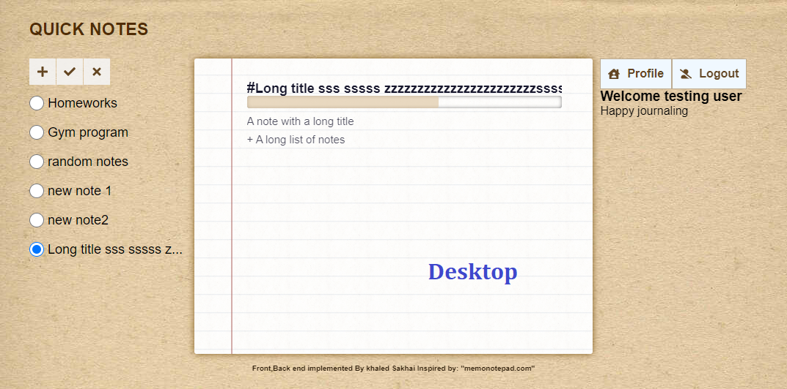
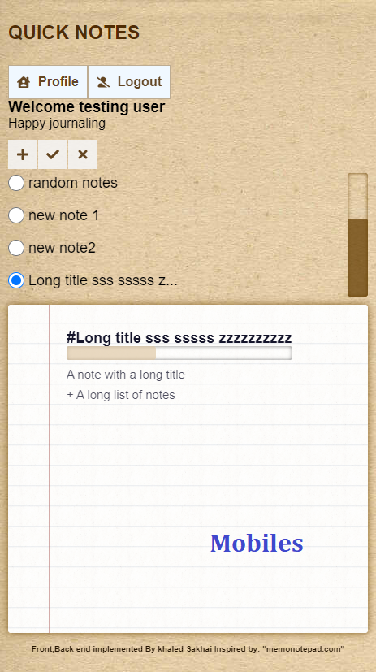
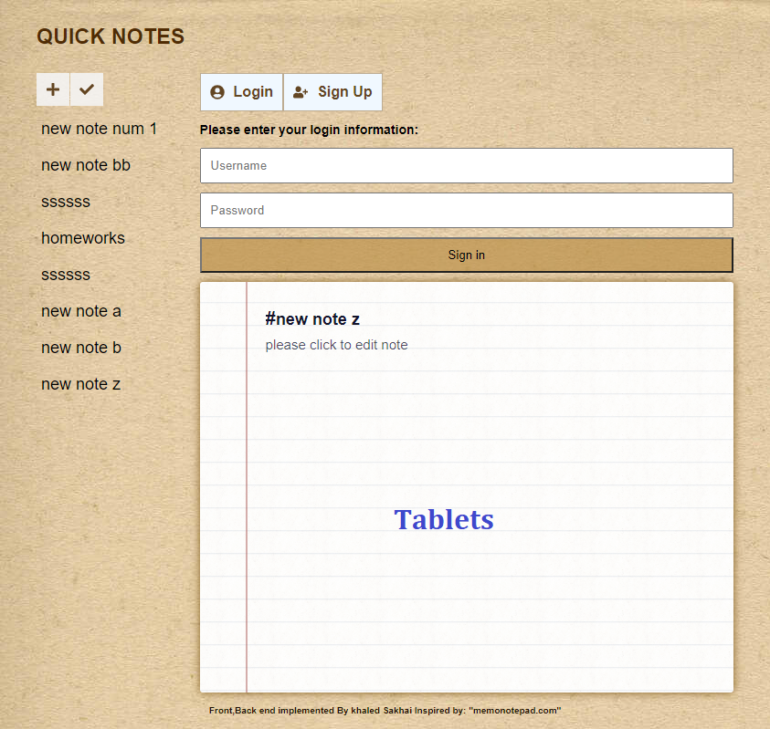

HELLO AND WELCOME!

Quick Notes is a simple and clean app for adding/editing/deleting/viewing notes

non-registered users are able to use the app and the data will be stored in the local storage
registered users are able to manage their notes from any where and the app uses a database and an API

langugues & frameworks:JAVA (Spring boot) , PostGres SQL, REACT js, Redux toolkit, CSS.

Deployed and hosted on AWS

DEMO:

(Doesn't work anymore - AWS charges too much--but I'll update it soon)
https://dev722.d2xnctd4n7kpt6.amplifyapp.com/

The app is fully responsive:

desktop:

mobile:

tablets:

